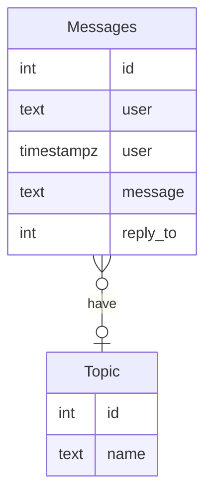

# Sonat Skravler

Velkommen skal dere være til fagdag i Svelte og Svelte Kit.
Det er nå tid for å bygge noe kult.

Dette prosjektet er 99% likt som et skaffoldet Svelte prosjekt, med noen få linjer kode lagt til for å gjøre det lettere å  koble seg opp mot Supabase som tar seg av backend delen av denne Chatten.

Her er noen nyttige lenker til Sveltes dokumentasjon.

[DOCS SVELTE](https://svelte.dev/docs)

[DOCS SVELTE KIT](https://kit.svelte.dev/docs/)

## Getting started

Du vil få utdelt en api-nøkkel som lar deg snakke med Supabase.
Denne nøkkelen må sammen med en url legges inn i en `.env`-fil.

- lag en fil som heter `.env` på rotnivå, dvs samme nivå som readme-filen

Det skal legges inn to variabler i denne filen:

```
VITE_SUPABASE_URL="https://mvmzdxdcvcswwhsldezm.supabase.co"
VITE_SUPABASE_ANON_KEY=Nøkkel-du-får-utdelt
```

Etter dette (eller før) er det bare til å kjøre gode gamle:

```
npm install
npm run dev
```

Modellen som ligger i Supabase ser slik ut:



Det ligger noen ferdiglagde spørringer i `lib/supabaseQueries.js`.

Disse kan brukes direkte, eller brukes som inspirasjon til egne spørringer